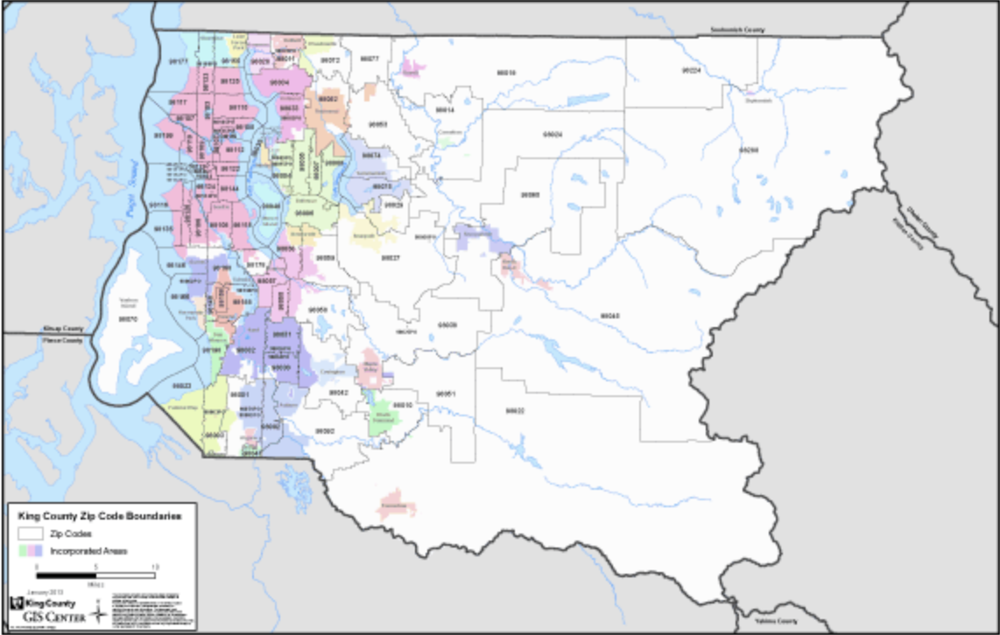

# Module 2 Project: Housing Predictions for House Flippers #

## Overview ##

Flipping houses for a living isn't new but in an ever shifitng housing market can be wrought with disapointment. The goal of this project is to create a model that will provide flippers looking to turn houses in King County with information to help make educated business choices. Where do you buy? What features would be most cost effective to add? When do I buy and when do I sell? We use a regression analysis of real estate information from 2014/2015 in this county to help give powerful answers to these questions to give both newcomers and pros the confidence to flip without flopping. 

## King County ## 

According to the U.S. Census bureau King County's population is a staggering 2.253 million residents. 20% of it's residents are under 18, and only 13.2% are over 65. It's a relatively young city. It is roughly 50/50 male vs. female. King County residents are 65% white and 20% Asian. It has 57% owner-occupied housing and the median value of these homes is $493,500 (more than double the national average). 93% of residents have a high school diploma and another 51% have a bachelor's degree, and the median income is $89,418. This is just a brief snapshot of the people who inhabit King County but does reveal that King County is full of young to middle-aged, middle class families who are mostly white. While living in King County is slightly cheaper than other counties within Seattle, it's still pricey. This isn't unusual in today's world though - with a significant increase in young people choosing the city over the suburbs cost of living in major cities is steadily increasing. 

## Contents ##

In this Repo you will find the following:

- 3 ipynbs
	1. [Preprocessing](https://github.com/carlyf15/dsc-mod-2-project-v2-1-online-ds-sp-000/blob/master/Preprocessing.ipynb)
	2. [Exploratory Data Analysis](https://github.com/carlyf15/dsc-mod-2-project-v2-1-online-ds-sp-000/blob/master/EDA.ipynb)
	3. [Modeling + Validation](https://github.com/carlyf15/dsc-mod-2-project-v2-1-online-ds-sp-000/blob/master/Modeling%20%2B%20Validation.ipynb)

- [Non-Technical Presentation Slides]()

## Methodology ##

* Tools
	-pandas, numpy, sklearn, matplotlib, seaborn, statsmodel, kmeans 
* Standards
	- alpha: .05 
* Assumptions of linearity, normality, and homoscedasticity met 
* Model validation performed using train/test split and comparing model residuals 

## Limitations ##

Building a linear regression often requires limiting the scope of the prediction. The real estate market in King County is quite variable and in order to make our model applicable it was necessary to focus on a specific market. The following specifications define the market out model can be used for.

	* Listings which have:
		- < 4,000 sqft
		- < 6 Bedrooms
		- < 6 Bathrooms
		- < 15,000 sqft lot size
		- < $1,000,000

Additionally there is no information in the dataset regarding some features which are important to buyers such as kitchens, backyards, garages, and school districts. 

## Inquiries ##

1. Which features are most correlated with price?
2. Is renovation or location more important?
3. Where are the most expensive houses?
4. Where are the highest graded houses?
5. What's more important, bedrooms or bathrooms?
6. Is it important to sell in a certain month?

## Recommendations ## 

1. ** GET ON THE WATER ** . If it's within your budget to buy a property on the water and then fix it up, you'll get the best bang for your buck. 
2. Pursue increasing both the grade value by the cities standards and increasing the overall condition of the house. Landscaping and paint are a great way to do this on a budget. 
3. Square footage is always important as you would imagine, but if you're going to add on a room, make it a bathroom. 
4. When it's time to sell, the more views the better. Hire a real estate agent to get the word out for you, the more visibility the better. Also, when it's time to sell, sell in either March or April. 

## Further Analysis ##

The limitation of this analysis were clearly stated above. Depending on the needs of the individual, this model may not be appropriate. It would be helpful to use the methods presented in this analysis as a template for analysis for custom needs. It would also be interesting to add a few more features to the dataset that tend to be important to buyers such as information concerning the kitchen, backyard (yes/no, size, features), garage (yes/no, sqft), and school districts. 

## Self Analysis ##

This project was much more conceptually challenging to me and I can tell there are still some concepts that feel fuzzy, especially validation and interpretation. I felt much more confident in my coding and visualization skills, and didn't feel limited by those things much during this project. Moving forward I feel I need to continue performing linear regression analysis in my spare time to maintain and master the skill. 

# Thank you & Happy Flipping! #

